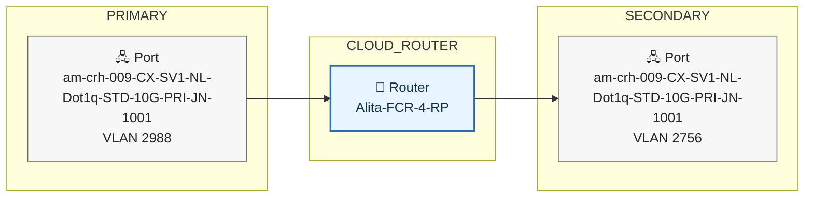

# Network Topology agent

## Overview
This definition sets up and activates an Equinix agent that creates network topology diagram depicting the FCR (Fabric Cloud Routers) related resource in a project. 

## Capabilities
- Automatically creates network topology diagram including IPWAN network, FCR and its connection destinations.
- Deliver the topology diagram via email as a PDF report

## Prerequisites
Fabric Cloud router resources exist in the given project. A valid FCR UUID must be available. Optional: valid IPWAN UUID.

## Instructions
### Step 1
Verify existing fabric cloud router which is not in deprovisioned status, given the FCR uuid. 
### Step 2
For each Fabric Cloud Router, search for all FCR connections of it using following request payload:
```json
{"filter":{"and":[{"property":"/direction","operator":"=","values":["OUTGOING","INTERNAL"]},{"property":"/project/projectId","operator":"=","values":["<project_uuid>"]},{"property":"/aSide/accessPoint/router/uuid","operator":"=","values":["<fcr_uuid>"]},{"property":"/operation/equinixStatus","operator":"=","values":["REJECTED_ACK","REJECTED","PENDING_DELETE","PROVISIONED","BEING_REPROVISIONED","BEING_DEPROVISIONED","BEING_PROVISIONED","CREATED","ERRORED","PENDING_DEPROVISIONING","APPROVED","ORDERING","PENDING_APPROVAL","NOT_PROVISIONED","DEPROVISIONING","NOT_DEPROVISIONED","PENDING_AUTO_APPROVAL","PROVISIONING","PENDING_BGP_PEERING","PENDING_PROVIDER_VLAN","PENDING_BANDWIDTH_APPROVAL","AUTO_APPROVAL_FAILED","UPDATE_PENDING","MODIFIED","PENDING_PROVIDER_VLAN_ERROR","DRAFT","CANCELLED","PENDING_INTERFACE_CONFIGURATION"]}]},"pagination":{"offset":0,"limit":25},"sort":[{"direction":"ASC","property":"/name"}]}

```
### Step 3
Convert the connections data from step 2 into Mermaid flowchart syntax, using following as an example, then convert the Mermaid syntax to PNG. Prefer a clean professional network-diagram look. Put the PNG picture in the report. Put CLOUD_ROUTER in the center of the diagram

### Step 4 - Render the Mermaid Diagram to PNG
Use the mermaid flowchart from Step 3, savid it as topology.mmd, and then render it to topology.png with Mermaid CLI, add the PNG file as attachment.
### Step 5 - Compose the Resource Hierarchy Report
**Do not respond to the user between Step 5 and Step 6, Proceed directly to calling `send_email_notification`.**


Rules:
- Plain English always. No raw event type strings, no API jargon.
- Always use both the human-readable name AND the full UUID when referencing any asset (router, connection, port, routing protocol) or user. Format: `<name> (<full-uuid>)` for assets and `<data.auth.name> (id: <authid>)` for users. If a name is not available, fall back to the full UUID only.
- Final observed state must be stated for any asset with multiple transitions.
### Step 6 — Send the Report
Use `send_email_notification` to send the report to `recipient_email_address`.
- `pdfContent`: the full report text from Step 4.
- `body`: one-paragraph summary of overall resource hierarchy and headline finding.
- `pdfTitle`: `FabricFCRNetworkTopologyReport-Project-<project_uuid first 8 chars>`

## Available Tools
This skill can use the following tools:

*   **`search_routers`**: Searches for an existing fabric cloud router.
*   **`search_connections`**: Searches for an existing fabric cloud router connection.
*   **`search_route_filters`**: Searches for an existing route filters attached to each fabric cloud router connection.
*   **`search_route_aggregations`**: Searches for an existing route aggregations attached to each fabric cloud router connection.
*   **`send_email_notification`**: Sends an email. Pass pdfTitle and pdfContent (plain text) to auto-generate and attach a PDF.

## Guidelines
*   **Prioritize Clarity**: Ensure all parameters for the MCP tools are clearly identified from the user's request before making the tool call.
*   **Token Efficiency**: Only call the tools when all necessary information is present, avoiding unnecessary context loading.

## Configuration
* **`project_uuid`**: < A project UUID > - Required - User should specify a project uuid.
* **`recipient_email_address`**: Required. Email address to receive the report.
* **`fcr_uuid`**: < A FCR UUID > - Optional - User can specify a FCR UUID.
